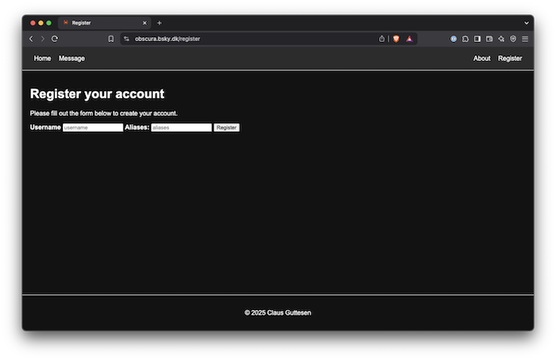
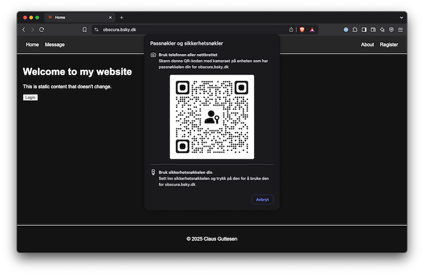
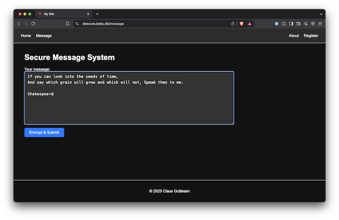
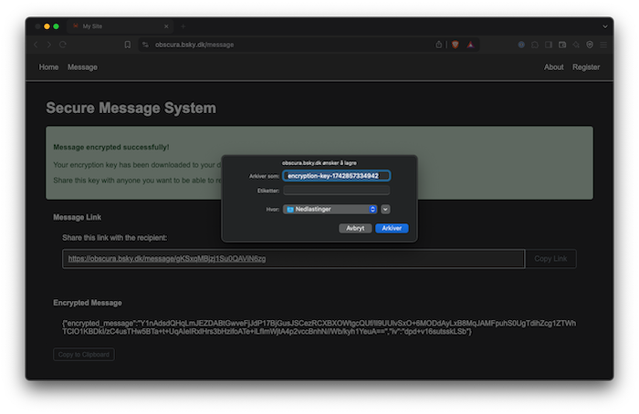
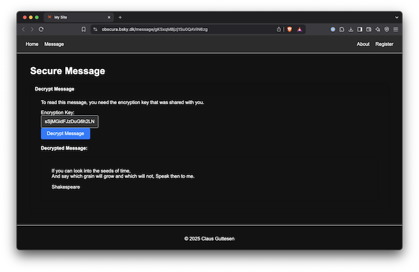

Write a message and encrypt it on your device using javascript and store the encrypted message on the server.
Share the encrypted message using a link and provide the recipient with the key downloaded to your device.

I had much help from Claude AI.

Decrypting the message can be done without registering an account. Creating encrypted messages requires a registration.
You can choose whatever username and alias you want. The login-information is registered on your device as a passkey.
The alias is hashed at Bitwarden and cannot be shown in plaintext, the username is only known to you.

The message can be decrypted on your device using the passkey.

To see it in action, visit the following link:

https://obscura.bsky.dk/message/gKSxqMBjzj1Su0QAViN6zg

and copy and paste the decryption key `sSjMGidFJzDuG6h2LNsxBHGr/dwgIoP+CWAOGgxRXZ8=` into the input field.

Register account (optional).

Store passkey (optional).

Write message (optional).

Download key (optional).

Decrypt message using provided key.

Login based on an example at https://github.com/davidzr/passwordless-rust and the Bitwarden passwordless
service at https://bitwarden.com/products/passwordless/.
